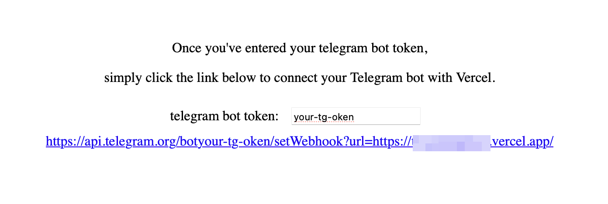

# tg-gemini-bot

[EN](README.md) | [简中](README_zh-CN.md) 

tg-gemini-bot 可让您直接在个人 Telegram 机器人上使用 Google Gemini 服务。

超级简单，只需单击一下，您就可以在 Vercel 上进行设置。

🚀 如果您不想自己部署，可以使用这个免部署的电报机器人： [GeminiBot](https://t.me/geminipro_api_bot). 该机器人是该项目的一个分支，提供完全相同的功能。

## 特点

- 这是用 Flask 构建的 - 超级简单且易于开发。
- 这是一个全前端项目，只需单击一下即可在 Vercel 上启动并运行。
- 支持Gemini连续通话。 （由于Vercel的限制，对话可能无法保存很长时间）
- 支持 Gemini 文本、图像界面和电报 Markdown。

## 准备工作

准备好这些东西，然后将它们作为Vercel中的环境变量填充。

- **GOOGLE_API_KEY**

  申请您的 Google Gemini Pro api: https://makersuite.google.com/app/apikey

- **BOT_TOKEN**

  创建您自己的电报机器人 ([查看教程](https://flowxo.com/how-to-create-a-bot-for-telegram-short-and-simple-guide-for-beginners/)), 获取机器人的token，格式类似: `67295022320:AAHmfuSQb0ZoUq0ycNPvgzqCCX7I1uzzaSE`

- **允许的用户或群组**

  收集有权访问此机器人的用户或群组 ID。 您可以使用`,，;；`中的任何符号或空格分隔它们。

  您还可以关闭身份验证，以便每个人和群组都可以使用它

  [了解更多](#环境变量)

## 开始使用

1. 点击  部署到 Vercel。

2. 按照下面的说明，**设置环境变量**。

3. 一切完成后，访问您的 Vercel 项目地址的域名。 （访问 Vercel 为项目提供的“Domains”而不是“Deployment Domains”。）

   或者，您只需单击`https://api.telegram.org/bot<bot-token>/setWebhook?url=<vercel-domain>` 即可将 Telegram 机器人连接到 Vercel 服务。 （记得将 `<token>` 和 `<vercel-domain>`替换为您实际对应的参数）

4. 在页面上填写您的 telegram bot token 以关联 telegram bot 和 vercel。

## 环境变量

| 环境变量 | 是否必须 | Description                                                                                                                            |
| -------------------- | --- | -------------------------------------------------------------------------------------------------------------------------------------- |
| GOOGLE_API_KEY       | 是 | 你的 Google Gemini Pro api，看起来像 `AI2aS4Cl55F9ni9WN84Qn_KWRSuqXvUWkPq6kovc `                                                  |
| BOT_TOKEN            | 是 | 您申请的 Telegram 机器人token，看起来像 `67295022320:AAHmfuSQb0ZoUq0ycNPvgzqCCX7I1uzzaSE`                                |
| ALLOWED_USERS        | 否 | 列出允许的用户的 Telegram 用户名。如果有多个，可以使用“,，;；”中的任意符号或空格将他们分开。它应该看起来像：`name1,name2`。包不包含`@`符号无所谓，所以`ohmorningsir`或`@ohmorningsir`都可以。无需区分大小写。如果您没有设置用户名，则可以使用 id 代替。使用 `/get_my_info` 来获取。 |
| ALLOWED_GROUPS | 否 | 列出允许的群组的 Telegram 用户名。如果有多个，可以使用“,，;；”中的任意符号或空格将他们分开。它应该看起来像：`group1,group2`。包不包含`@`符号无所谓，所以`ohmorningsirs_group`或`@ohmorningsirs_group`都可以。无需区分大小写。如果是私人群组，可以使用id代替。使用`/get_group_info`来获取。 |
| ADMIN_ID | 否 | 十位数的 telegramID。 如果要启用调试模式，则必须正确设置该值。 |
| IS_DEBUG_MODE | 否 | 是否启用调试模式。`0` 禁用。`1` 启用。默认值为 `0` 。 |
| AUCH_ENABLE | 否 | `0` 禁用身份验证。任何人都可以使用这个机器人。`1` 启用身份验证。默认为 `1` 。 |
| GROUP_MODE | 否 | `1` 在群组中使用共同的聊天记录，`2`为每个人单独记录聊天记录。默认为 `1` 。 |

提示：修改环境变量后，需要重新部署才能生效。需要进入Vercel项目的内部控制台，点击顶部的`Deployments`按钮，选择列表顶部项右侧的`···`按钮，不是“Deployments”标题正右方的按钮！点击 `Redeploy` 即可重新部署。

## 命令列表

`/new` 开始新的聊天

`/get_my_info` 获取个人信息

`/get_group_info` 获取群组信息（仅群组可用）

`/get_allowed_users` 获取允许使用机器人的用户列表（仅管理员可用）

`/get_allowed_groups` 获取允许使用机器人的群组列表
/list_models 列出模型（仅管理员可用）

`/get_api_key` 获取gemini的apikey的列表，目前没有用，以后可能会添加多个key自动切换（仅管理员可用）

`/list_models` 列出模型（仅管理员可用）

`/help` 获取帮助

`/5g_test` :)

## 群组使用

邀请机器人进入群组添加为管理员，机器人会响应群内的所有消息，否则只会响应与机器人有关的消息，使用时需要@机器人或回复机器人发送的任意消息。

目前不能很好的支持 topic 群组，机器人发送的所有消息都会发在 General 中。

## 如何找出问题所在

因此，如果您已经按照我们所说的那样一步一步完成了所有操作，但您的 Telegram 机器人仍然没有执行其操作，那么最好查看 Vercel 日志以了解发生了什么情况。

1. 在vercel中打开您的项目，点击**Deployments**选项卡，检查部署是否成功，如果有错误，请根据错误提示进行修改。

2. 如果这里没有发生错误，打开**Logs**选项卡，单击错误日志，程序的输出将显示在右侧。

3. 如果有任何错误消息，您可以打开一个issue，然后提供错误信息。
